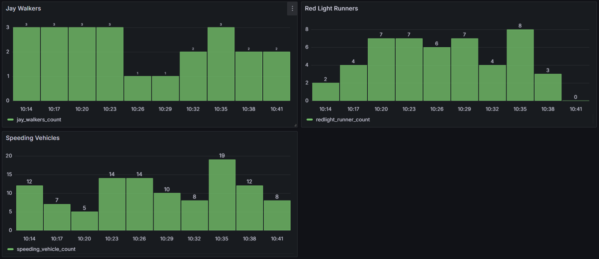

# Traffic Monitoring Capstone

 

## Table of Contents

[Description](#description)

[Installation](#installation)

[Usage](#usage)

[Grafana](#Grafana)

[Credits](#credits)

[License](#license)

[Questions](#questions)

## Description

This application similuates simple traffic at an intersection, and then stores that information in a MongoDB database, going through Apache Kafka as a broker. The data is then fed to a MySQL database where queries can be made to summarize the data, and this summary data is displayed on a Grafana Dashbaord. 

## Installation

The application has many dependencies. First, it requires python. It was built using python verison 3.12.3. Second, it requires Docker, as the MongoDB database, Apache Kafka producers and consumers, MySQL, and Grafana are all encompassed in Docker containers. Docker Desktop is a valuable tool for managing these containers. It is also recommended to use MongoDB Compass as a user interface for exploring your documents and collections. After having Python 3 in your environment, you will also need to use the following commands to install third party dependencies:
 
 `pip install conluent_kafka`

 `pip install pymongo`

 `pip install mysql-connector-python`

 You must also install Grafana Enterprise if you want to view the dashboards of the data summaries. 

## Usage

First, run the docker-compose.yml file from your terminal while in the appropriate directory. It's advised that you double check Docker Desktop to ensure that all of your containers are running. If all of your containers are running, you can then run the python script in the traffic.py file. This will start populating kafka and mongodb with generated vehicle and pedestrian traffic at this intersection. You can confirm this in MongoDB Compass.

You must run the python script dbConnect.py to send the data from MongoDB to the MySQL database. This script runs on a loop, pulling data from MongoDB every 3 minutes. From there you can run MySQL queries to view not only summary data, but also License Plate information for traffic law violators (speeders and red light runners).

Start with `USE traffic_info`

A few simple queries would include:

    `SELECT * FROM redlight_runners;`

    `SELECT * FROM speeding_vehicles;`

    `SELECT * FROM traffic_stats;`

Here is the output example of a query as displayed in the MySQL Workbench 8.0.

## Grafana

While the containers are running, Access Grafana by navigating to 'http://localhost:3001'  
Log in using credentials('admin'/'password')  
Configure the connection to MySQL database:  
 Host: 'mysql:3306'  
 Database: 'traffic_data'  
 User: 'user'  
 Password: 'pass'

Configure the host to Prometheus:  
 Host: 'http://prometheus:9090'

You can paste the JSON from GrafanaDashboard.json into Grafana to have the dashboard already built out. While in Grafana in a browser on localhost port 3001, click the + in the top right corner. Click Import Dashboard. From there, find the box that says 'Import via dashboard JSON model', and paste the JSON from GrafanaDashboard.json

## Credits

Contributors include Dara Prak, Sana Mohiuddin, and Adam Johnson.

## License

 

The following third party technologies were used:
- **MongoDB**: Licensed under the Server Side Public License (SSPL). [MongoDB License](https://www.mongodb.com/licensing/server-side-public-license)
- **Prometheus**: Licensed under the Apache 2.0 License. [Prometheus License](https://github.com/prometheus/prometheus/blob/main/LICENSE)
- **Grafana**: Licensed under the Apache 2.0 License. [Grafana License](https://github.com/grafana/grafana/blob/main/LICENSE)
- **MySQL**: Licensed under the GNU General Public License (GPL). [MySQL License](https://www.mysql.com/about/legal/licensing/oem/)
- **Docker**: Licensed under the Apache 2.0 License. [Docker License](https://github.com/moby/moby/blob/master/LICENSE)
- **Python**: Licensed under the Python Software Foundation License. [Python License](https://docs.python.org/3/license.html)
- **Confluent Platform**: Many components are licensed under the Apache 2.0 License, but some components are under the Confluent Community License. [Confluent License Information](https://www.confluent.io/product/confluent-platform/software-licensing/)

## Questions?

Contact us:

Adam Johnson:

    - Email: adamgjohnson92@gmail.com

    - GitHub: AdamJohnson92

Dara Prak:

    - Email: dprak107@gmail.com

    - GitHub: daraprak

Sana Mohiuddin:

    - Email: smohiuddin1688@gmail.com

    - GitHub: Smohiudd1688
